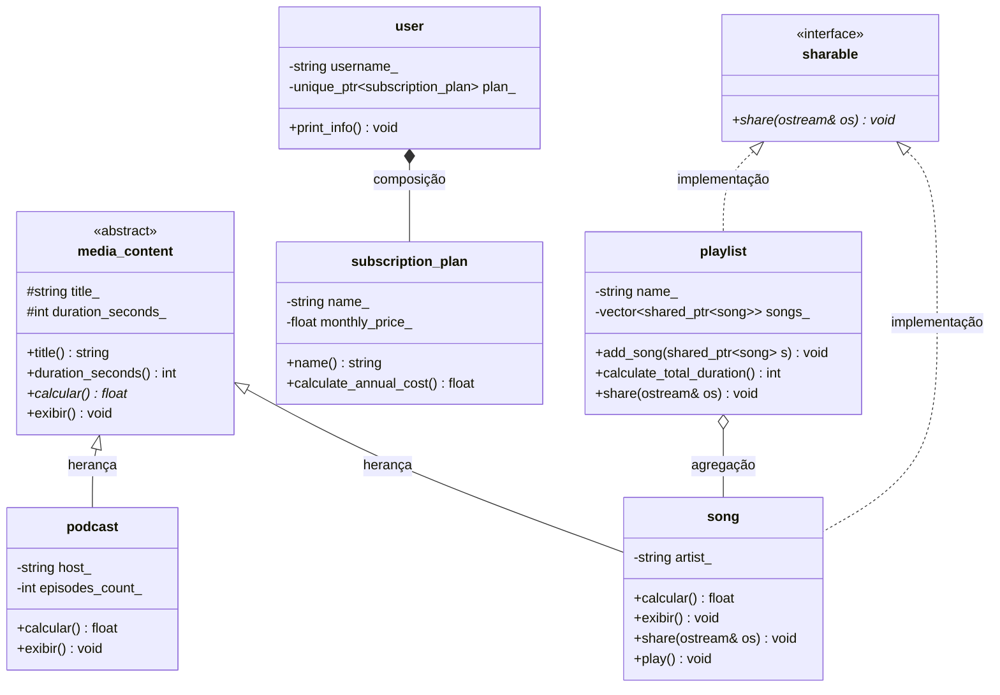
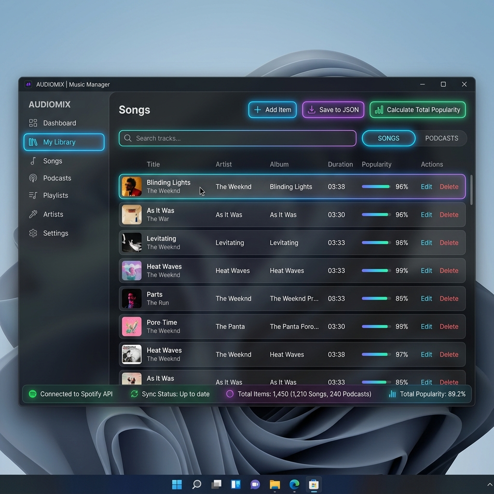

# Projeto POO - Plataforma de streaming de música

**Nome:** Maria Clara Caldas Fernandes
**Matrícula:** 20250018870

## Descrição do Domínio:
O sistema consiste em uma plataforma de streaming de música. Ele gerencia assinantes (`user`), que possuem um plano de assinatura exclusivo (`subscription_plan`). Além disso, o sistema permite a criação de playlists (`playlist`) que agrupam diversas músicas (`song`) disponíveis no catálogo da plataforma.

## Diagrama UML de Classes :



## Herança Avançada

Neste projeto, a classe `podcast` foi marcada com a palavra-chave `final`:
```cpp
class podcast final : public media_content { ... };
```
**Justificativa de Design:**
1. **Impedir Especialização Adicional:** A classe `podcast` representa um tipo de conteúdo final no nosso modelo de streaming de mídia. Não há justificativa de negócio ou arquitetura para estender um `podcast` em novas subclasses.
2. **Otimização do Compilador (Devirtualização):** Ao marcar a classe como `final`, informamos ao compilador que nenhuma outra classe poderá herdar dela. Isso permite que o compilador otimize chamadas de métodos virtuais (como `calcular()` e `exibir()`) transformando-as em chamadas diretas não-virtuais quando o tipo estático é conhecido, eliminando o overhead de consulta na tabela de métodos virtuais (vtable).

## Programação Genérica

### 1. O que o template abstrai
O template `registry<T>` encapsula o comportamento de um contêiner genérico de itens do domínio (como músicas ou podcasts), fornecendo métodos comuns (`add`, `at`, `size`, iteradores) para gerenciar coleções homogêneas sem duplicação de lógica.

### 2. Por que CRTP em vez de herança virtual
A classe `counted<Derived>` utiliza CRTP (Curiously Recurring Template Pattern) para realizar a contagem estática e independente de instâncias ativas de cada classe derivada (`song` e `podcast`).
Ao contrário da herança virtual clássica, o CRTP resolve o comportamento em tempo de compilação (polimorfismo estático). Isso elimina a necessidade de ponteiros de tabela virtual (vptr) e consultas na vtable para este comportamento específico, economizando memória e reduzindo o custo de chamada para zero (zero-cost abstraction).

### 3. Ranges Pipeline vs. Laço Tradicional
**Laço Tradicional (Imperativo):**
```cpp
std::vector<std::string> titulos_longos;
for (const auto& s : playlist_songs) {
    if (s.duration_seconds() > 240) {
        titulos_longos.push_back(s.title());
    }
}
```
**Ranges Pipeline (Declarativo C++20):**
```cpp
auto titulos_longos = playlist_songs
    | rv::filter([](const song& s) { return s.duration_seconds() > 240; })
    | rv::transform([](const song& s) { return s.title(); });
```
*Antes (Laço):* Exige a criação de um contêiner temporário, controle manual de iteração e escrita imperativa.
*Depois (Ranges):* Avaliação preguiçosa (lazy evaluation) que não cria contêineres intermediários em memória, sintaxe limpa baseada em pipes composíveis e foco no *o que* fazer em vez de *como* fazer.

## SOLID

1. **Single Responsibility Principle (SRP):** Cada classe possui uma única responsabilidade. Por exemplo, a classe `song` gerencia apenas dados e regras de música, enquanto `json_repository` gerencia apenas a serialização do estado em arquivo JSON (a persistência foi completamente desacoplada do núcleo do domínio).
2. **Open/Closed Principle (OCP):** A classe base `media_content` está aberta para extensão (podemos herdar novas classes de mídia, como `video` ou `audiobook`) e fechada para modificação (nenhuma regra existente de `streaming_service` ou `maior_valor` precisa mudar).
3. **Liskov Substitution Principle (LSP):** As classes derivadas `song` e `podcast` podem substituir perfeitamente seu tipo base `media_content` sem alterar a correção do programa em métodos polimórficos.
4. **Interface Segregation Principle (ISP):** Criamos a interface segregada e pura `sharable`, permitindo que classes independentes como `playlist` e `song` a implementem sem herdar campos desnecessários de uma base comum inflada.
5. **Dependency Inversion Principle (DIP):** O serviço `streaming_service` (alto nível) não depende diretamente de `json_repository` (baixo nível/infraestrutura). Em vez disso, ele depende da abstração `repository`, injetada no construtor.

## Qt

### Instruções de Build do Qt:
Caso o sistema possua o Qt6 instalado, o CMake detectará a biblioteca automaticamente e habilitará o alvo `gui`. Para compilar e rodar a interface gráfica:
```bash
cmake -B build -DCMAKE_BUILD_TYPE=Debug
cmake --build build
./build/gui
```

### Screenshot da Janela em Execução:



