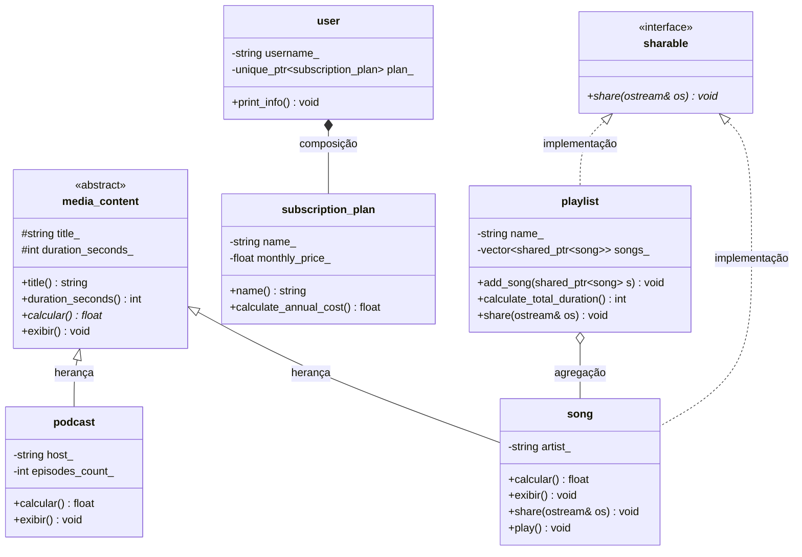

# Projeto POO - Plataforma de streaming de música

**Nome:** Maria Clara Caldas Fernandes
**Matrícula:** 20250018870

## Descrição do Domínio:
O sistema consiste em uma plataforma de streaming de música. Ele gerencia assinantes (`user`), que possuem um plano de assinatura exclusivo (`subscription_plan`). Além disso, o sistema permite a criação de playlists (`playlist`) que agrupam diversas músicas (`song`) disponíveis no catálogo da plataforma.

## Diagrama UML de Classes :



## Herança Avançada

Neste projeto, a classe `podcast` foi marcada com a palavra-chave `final`:
```cpp
class podcast final : public media_content { ... };
```
**Justificativa de Design:**
1. **Impedir Especialização Adicional:** A classe `podcast` representa um tipo de conteúdo final no nosso modelo de streaming de mídia. Não há justificativa de negócio ou arquitetura para estender um `podcast` em novas subclasses.
2. **Otimização do Compilador (Devirtualização):** Ao marcar a classe como `final`, informamos ao compilador que nenhuma outra classe poderá herdar dela. Isso permite que o compilador otimize chamadas de métodos virtuais (como `calcular()` e `exibir()`) transformando-as em chamadas diretas não-virtuais quando o tipo estático é conhecido, eliminando o overhead de consulta na tabela de métodos virtuais (vtable).

